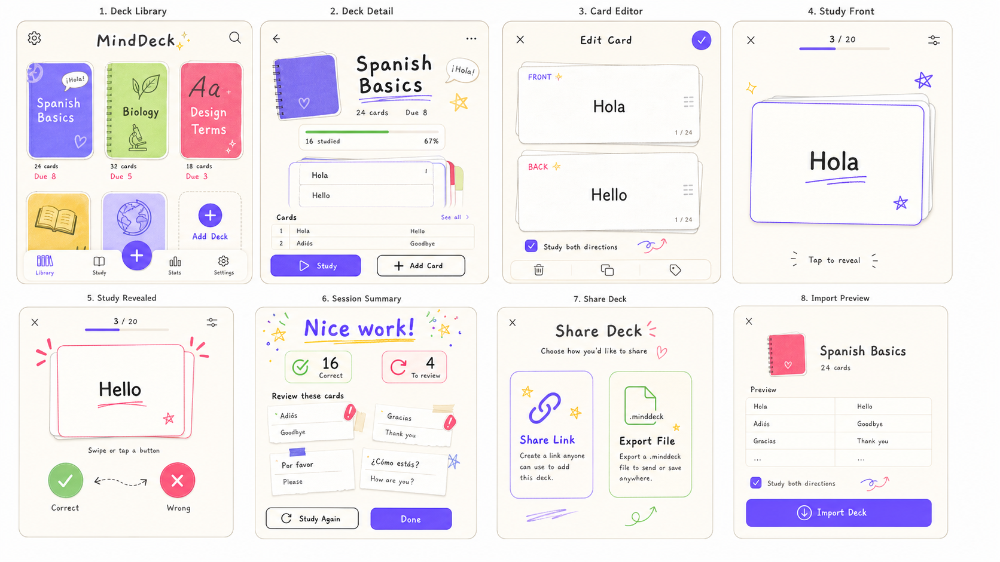

# MindDeck



MindDeck is a joyful, local-first flashcard app for iOS, Android, macOS,
Windows, and Linux. Create text-only decks, reveal each answer, grade yourself,
and let the learning engine bring difficult and due cards back first.

No account is required. Decks and learning history stay on the device.

## What is included

- Unlimited decks and front/back text cards
- Self-graded study with Wrong and Correct actions
- Deterministic spaced review across days
- Recovery cards reinserted into the current session
- Optional front-to-back and back-to-front study
- SQLite persistence with progress reset when card content changes
- Shareable, serverless URL snapshots
- Portable `.minddeck` files with an import preview and confirmation
- Independent imported copies, so later edits never affect the sender
- Deep links for imports and one-tap study
- Native iOS and Android home-screen widgets
- Responsive layouts for phones, tablets, and desktop windows
- A matching GitHub Pages product site
- CI, Pages deployment, and five-platform tagged releases

## Privacy-first sharing

MindDeck serializes a deck into a versioned canonical snapshot, compresses it,
and places the payload after the URL fragment:

```text
https://isaaclins.github.io/MindDeck/open#md1.<payload>
```

URL fragments are not sent to the web server. The bridge page attempts to open
the app with `minddeck://import#md1.<payload>` and keeps the payload on the
device. A `.minddeck` export uses the same validated data model in a portable
file container.

Every import is shown as a preview first. The learner must explicitly confirm
before a new local deck is created.

## Architecture

```text
Flutter UI and navigation
├── Deck editor and responsive library
├── Study session controller and scheduler
├── Share and import preview flow
└── Native widget bridge
    ├── WidgetKit and App Group storage
    └── Android AppWidget and SharedPreferences

Local data
├── Drift and SQLite deck storage
└── Per-card, per-direction learning progress

Distribution
├── Vite and React marketing site
├── GitHub Pages deep-link bridge
└── GitHub Actions CI and tagged releases
```

## Run locally

Install a current stable Flutter SDK and confirm the toolchain:

```bash
flutter doctor
flutter pub get
dart run build_runner build
flutter run
```

The repository contains platform projects for Android, iOS, macOS, Windows,
and Linux. Platform builds still require the corresponding host toolchain.

## Verify the app

```bash
dart format --output=none --set-exit-if-changed lib test integration_test
flutter analyze
flutter test
flutter test integration_test/app_flow_test.dart -d <device>
```

## Run the site

```bash
cd website
npm ci
npm run dev
npm test
npm run build
```

The production site is deployed from GitHub Actions to
<https://isaaclins.github.io/MindDeck/>.

## Releases

Continuous integration checks formatting, static analysis, tests, and builds
on every pull request and push to `main`. Pushing a SemVer tag such as
`v0.1.0-beta.1` creates a prerelease with Android, unsigned iOS, macOS,
Windows, and Linux artifacts.

```bash
git tag v0.1.0-beta.1
git push origin v0.1.0-beta.1
```

Store signing is intentionally separate from the public build pipeline. The
beta Android APK is development-signed, the iOS and Windows artifacts are
unsigned, and the macOS build is unnotarized. Store publication and trusted
desktop distribution require owner-controlled signing credentials.

## Design

The interface uses warm paper surfaces, violet flashcards, high-energy sticker
accents, hand-drawn display type, tactile borders, and restrained motion. The
visual direction is inspired by handmade collection apps while keeping
MindDeck's product language and assets original.

## Status

MindDeck is currently pre-release software at version `0.1.0-beta.1`.
